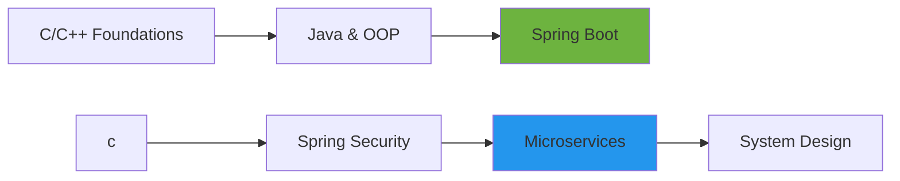

# Hi there, I'm Nabin Oli 👋

<div align="center">
  
  [](https://nabinoli.vercel.app/)
  [](mailto:nabinstrivex@gmail.com)
  [](https://www.youtube.com/@discoverynepal99)
  
</div>

## 🚀 About Me

```java
public class NabinOli {
    private String role = "Backend Architect";
    private String education = "Class 12 @ Liverpool International College";
    private String location = "Kathmandu, Nepal";
    private String status = "AVAILABLE_FOR_INTERNSHIP";
    
    public String[] getCurrentFocus() {
        return new String[]{
            "Building production-ready REST APIs",
            "Mastering Spring Boot ecosystem",
            "Learning distributed systems & microservices",
            "Focusing on Spring Security"
        };
    }
}
```

🎯 **Backend Developer** specializing in **Java & Spring Boot** | Transforming low-level C/C++ logic into high-performance APIs  
📚 17-year-old tech learner passionate about system architecture and scalable backend solutions  
🔭 Currently exploring JWT authentication, Redis caching, and containerization with Docker

## 🛠️ Tech Stack

### Core Technologies


### Frameworks & Libraries


### Databases


### DevOps & Tools


## 🏗️ Featured Projects

### 🔐 [TaskMaster API](https://github.com/nabinoli99/TaskMaster_nb)
**Spring Boot RESTful Backend with RBAC**
- Implemented Role-Based Access Control (RBAC) for secure resource management
- JWT-based stateless authentication & authorization
- **Stack:** Java, Spring Boot, Spring Security, JWT, PostgreSQL, Docker

### 🚗 [Parking Ledger System](https://github.com/nabinoli99/SpringFrameworkCodes/tree/main/Spring%20Projects/Vehicle_Parking_Entry)
**Transactional Entry/Exit Management System**
- High-concurrency vehicle tracking with automated fee calculation
- Financial-grade transaction management with Spring @Transactional
- Comprehensive test coverage (94%) with JUnit 5
- **Stack:** Java 17, Spring Boot, Spring Data JPA, PostgreSQL

### 📦 [Inventory Management System](https://github.com/nabinoli99/SpringFrameworkCodes)
**Audited Inventory System with JPA Entity Listeners**
- Automatic audit logging using JPA Entity Listeners
- RESTful API design following best practices
- **Stack:** Java, Spring Boot, Hibernate, JPA

## 📈 GitHub Statistics

<div align="center">
  
  
  
</div>

## 🎯 Current Learning Path



**2024-2025 Journey:**
- ✅ Mastered C/C++ memory models and pointers
- ✅ Deep dive into Java Collections & Multi-threading
- ✅ Built transactional APIs with Spring Boot & JPA
- 🔄 Currently: JWT authentication, OAuth2, Redis caching
- 🎯 Next: System Design patterns and microservices

## 💼 What I'm Looking For

🌟 **Open to:**
- Backend Development Internships
- Open-source collaborations
- Code reviews and mentorship
- Spring Boot project contributions

## 📫 Let's Connect

- 💼 Portfolio: [nabinoli.vercel.app](https://nabinoli.vercel.app/)
- 📧 Email: nabinstrivex@gmail.com
- 📍 Location: Kathmandu, Nepal
- 🎥 YouTube: [@discoverynepal99](https://www.youtube.com/@discoverynepal99)


<div align="center">
  
  ### 🔥 "First, solve the problem. Then, write the code."
  
  
  
  ⭐️ From [nabinoli99](https://github.com/nabinoli99) | Always learning, always building  🚀 _ FinleySimula67

  > Nabin_StriveX <
  
</div>
